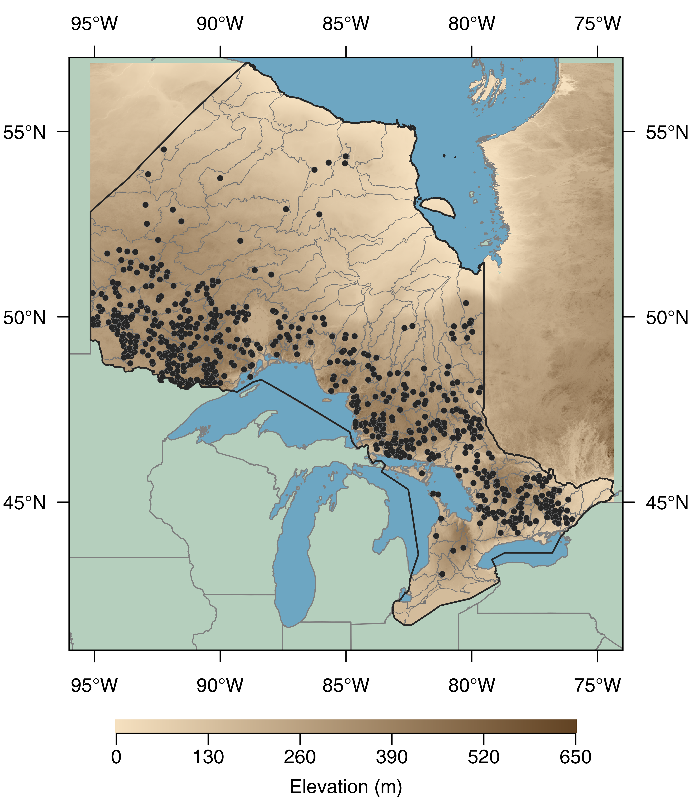

# getMaps

R scripts to retrieve climate data and create different maps.

## R packages required

- graphicsutils, see https://github.com/inSileco/graphicsutils
- [mapview](https://cran.r-project.org/web/packages/mapview/index.html) which
imports all packages required.


## Spatial data

### Climate data

See http://cfs.nrcan.gc.ca/projects/3/8
There is two ways to retrieve climate data:

- use the bash script: `getMaps.sh` in  `bash/`;
- use the R script: `retrieveClimatData.R` in `R/`.


### Elevation Data

- Elevation data as well as administrative boundaries are retrieved using `getData()`
from the `raster` but not included in the repository the get these data source
`getData.R`:

```r
source("getData.R")
```

### Shapefiles

- Great lakes shapefiles available at: https://www.sciencebase.gov/catalog/item/530f8a0ee4b0e7e46bd300dd

- Tertiary watersheds: https://www.ontario.ca/data/watershed-tertiary

- Secondary watersheds: https://www.ontario.ca/data/watershed-secondary


### Land Use data

See https://open.canada.ca/data/en/dataset/18e3ef1a-497c-40c6-8326-aac1a34a0dec


## Maps

### Basic map


### Custom map



### Map Stream


## References

1. See tutorials on [inSileco](https://insileco.github.io/2018/04/14/r-in-space---a-series/created)

2. and a very helpful representation by @mhBrice: https://mhbrice.github.io/Rspatial/

Both links above include a list of useful resources.
