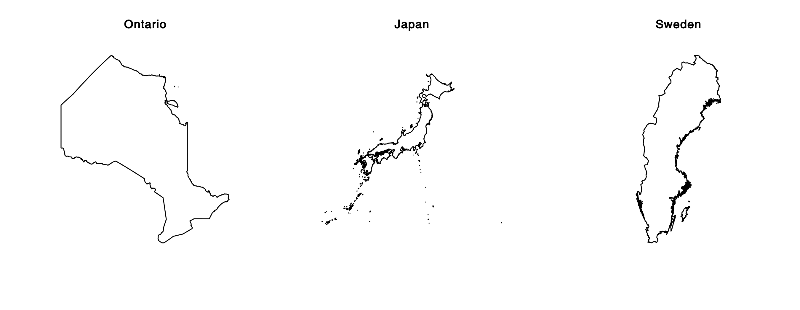

# getMaps

R scripts to retrieve climate data and create different maps.

## Installation

```R
install.packages("devtools")
remotes::install_github("inSileco/graphicsutils")
install.packages(c("sf", "sp", "rgeos", "raster", "tidyverse", "rgdal"))
```

Notes:

- graphicsutils, see https://github.com/inSileco/graphicsutils
- [mapview](https://cran.r-project.org/web/packages/mapview/index.html) which
imports all packages required.


## Spatial data

### Climate data

See http://cfs.nrcan.gc.ca/projects/3/8
There is two ways to retrieve climate data:

- use the bash script: `getMaps.sh` in  `bash/`;

```shell
cd bash
sh getMaps.sh
```

- use `retrieveClimatData()`.


```R
source("R/retrieveClimateData.R")
retrieveClimateData(years = 2014:2015, info = "bio", res = 300)
```


### Elevation Data

- Elevation data as well as administrative boundaries are retrieved using `getData()` from raster package

```R
source("R/retrieveClimatData.R")
```


### Shapefiles

- Great lakes shapefiles available at: https://www.sciencebase.gov/catalog/item/530f8a0ee4b0e7e46bd300dd

- Tertiary watersheds: https://www.ontario.ca/data/watershed-tertiary

- Secondary watersheds: https://www.ontario.ca/data/watershed-secondary


### Land Use data

See https://open.canada.ca/data/en/dataset/18e3ef1a-497c-40c6-8326-aac1a34a0dec


## Maps -- examples

### Basic map

See `R/basicMaps.R`




## References

1. See tutorials on [inSileco](https://insileco.github.io/2018/04/14/r-in-space---a-series/created)

2. a very helpful representation by @mhBrice: https://mhbrice.github.io/Rspatial/

Links above include a list of useful resources.
